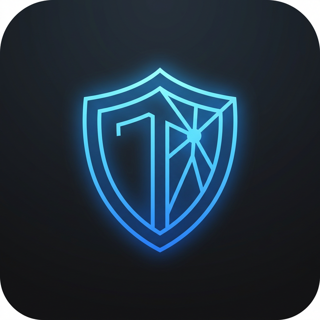
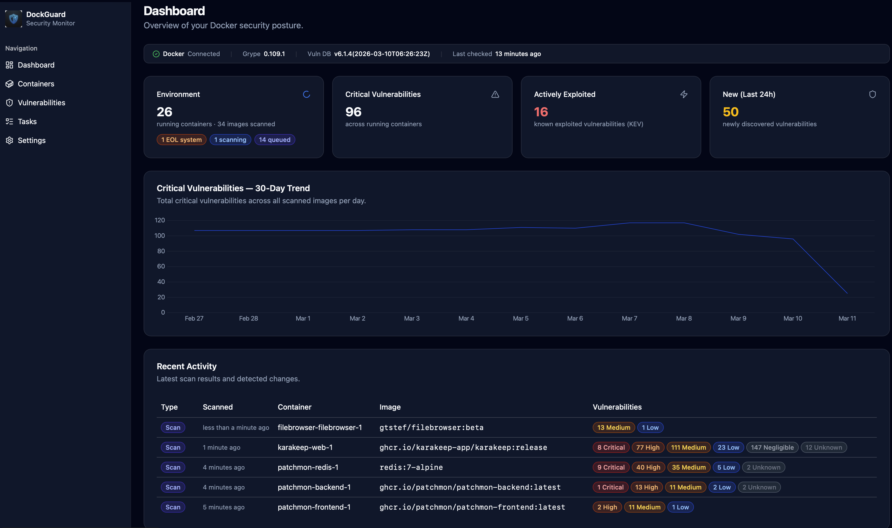
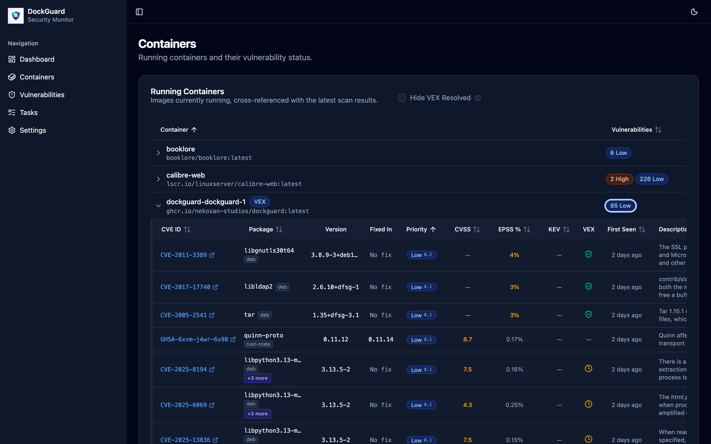
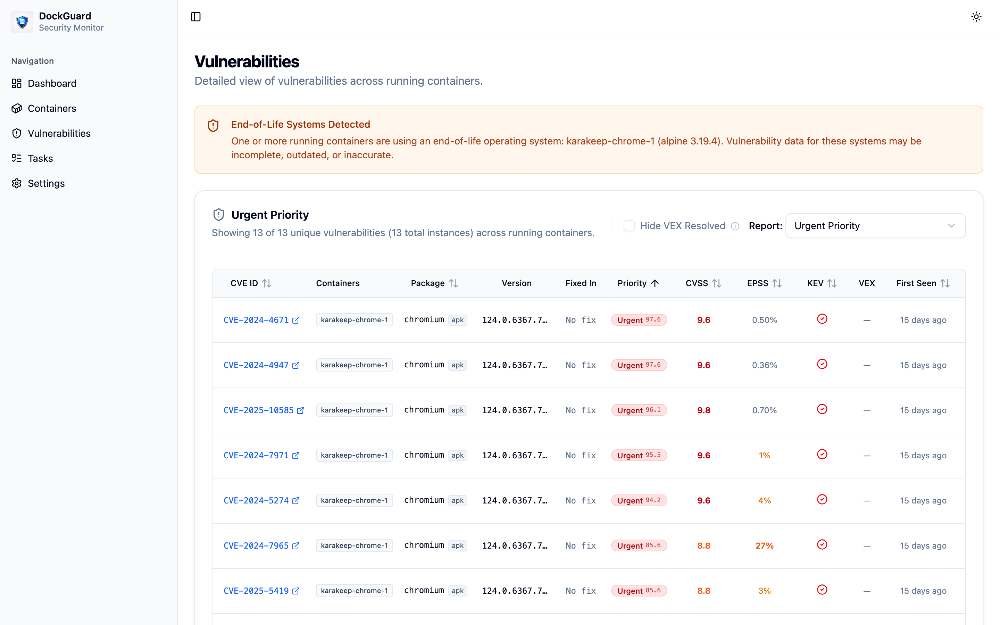

<div align="center">
  

  # DockGuard

  **Automatic vulnerability scanning for your self-hosted Docker containers.**
</div>

---

DockGuard is a free, self-hosted security scanner built for home labbers and self-hosters. It watches your running Docker containers, automatically scans every image for known vulnerabilities, and gives you a clean web dashboard to understand your exposure.

> **Note:** DockGuard is currently limited to single-host setups. Features like multi-user support and connecting to remote Docker installations are on the roadmap but not yet available.

> **Security:** DockGuard does not currently have authentication or user login. Do not expose it directly to the internet or untrusted networks. Run it behind a VPN, reverse proxy with authentication, or bind it only to `localhost` / your local network. If you need remote access, place it behind a solution like Authelia, Authentik, or your reverse proxy's built-in auth.

## Screenshots

**Dashboard**


**Containers**


**Vulnerabilities**


## Features

- **Simple to install** — Up and running after reviewing a few values in the docker compose file.

- **Always watching** — DockGuard monitors your running containers continuously. Pull a new image or update an existing one, and it's scanned automatically. No manual triggers, no cron jobs to configure.

- **Keeps itself current** — DockGuard periodically checks whether a newer vulnerability database is available. When it finds one, it re-scans all your images automatically.

- **Prioritise what actually matters** — Vulnerabilities are enriched with [CVSS](https://www.first.org/cvss/) severity scores, [EPSS](https://www.first.org/epss/) exploit probability, and the [CISA KEV](https://www.cisa.gov/known-exploited-vulnerabilities-catalog) (Known Exploited Vulnerabilities) catalog. Sort and filter by any of these to focus on the findings most likely to matter to you.

- **Cut through false positives** — Some CVEs exist in an image but cannot actually be exploited in your environment. DockGuard supports [VEX (Vulnerability Exploitability eXchange)](https://www.cisa.gov/sites/default/files/2023-01/VEX_Use_Cases_Approved_508c.pdf) attestations: when an image publisher has officially marked a vulnerability as not exploitable in their image, DockGuard can suppresses it so you focus on real risk, not noise.

- **Track history over time** — See how your exposure changes as you update images and compare results across versions.

- **Notifications** — Get alerted when new vulnerabilities are found. DockGuard supports Apprise-compatible notification channels (Slack, Discord, email, and many more).

- **Fully self-hosted** — No cloud account. No telemetry. No subscription. DockGuard runs entirely on your machine and stores all data locally in a SQLite database.


## Requirements

- Docker
- Docker Compose

That's it. Dockguard only supports local docker instances, so run it where your existing Docker stack lives. Everything else needed is bundled inside the DockGuard container.

## Quick Start

1. Save the following as `docker-compose.yml`:

```yaml
services:
  socket-proxy:
    image: ghcr.io/tecnativa/docker-socket-proxy:latest
    volumes:
      - /var/run/docker.sock:/var/run/docker.sock:ro
    environment:
      CONTAINERS: 1   # Allow listing/inspecting containers (read-only)
      IMAGES: 1       # Allow listing images (read-only)
    restart: unless-stopped

  dockguard:
    image: ghcr.io/nekosan-studios/dockguard:latest
    ports:
      - "8764:8764"
    volumes:
      - ./data:/app/data  # Persistent scan database
    environment:
      TZ: UTC  # Set your local timezone
      DOCKER_HOST: tcp://socket-proxy:2375
      BASE_URL: http://your-server-ip:8764  # Public URL for deep links in notifications
    depends_on:
      - socket-proxy
    restart: unless-stopped
```

> **Why use a socket proxy?**
> Mounting the Docker socket (`/var/run/docker.sock`) directly into a container grants it unrestricted root-equivalent access to your Docker daemon — it could start, stop, or delete any container, pull images, or escape to the host. [docker-socket-proxy](https://github.com/Tecnativa/docker-socket-proxy) sits between DockGuard and the socket, blocking every API call except the ones explicitly allowed. DockGuard only needs to list running containers and images (`CONTAINERS=1` and `IMAGES=1`), so all other Docker API endpoints — including anything that could modify your environment — are denied.

> **Note:** On startup, docker-socket-proxy logs a haproxy warning about missing timeouts for the `docker-events` backend. This is a known cosmetic issue ([#123](https://github.com/Tecnativa/docker-socket-proxy/issues/123)) and does not affect functionality. The proxy is working correctly if you see `Loading success.` at the end of its startup output.

2. Review the compose file and adjust as needed:
   - Change `./data` to your preferred location for the scan database
   - Update the `BASE_URL` to enable clickable links in notifications
   - Set the `TZ` environment variable to your local timezone

3. Start it:

```bash
docker compose pull
docker compose up -d
```

4. Open [http://localhost:8764](http://localhost:8764).

DockGuard will check to make sure the vulnerability database is up to date and begin scanning your containers within a few minutes.

## Configuration

Most settings can be changed directly in the **Settings** page of the dashboard. The environment variables below are also available if you prefer to set them at the infrastructure level.

| Variable | Default | Description |
|---|---|---|
| `TZ` | `UTC` | Your local timezone. |
| `SCAN_INTERVAL_SECONDS` | `60` | How often (in seconds) to check for new or updated containers. |
| `MAX_CONCURRENT_SCANS` | `1` | How many images to scan in parallel. Increase with caution on low-memory systems. |
| `DB_CHECK_INTERVAL_SECONDS` | `3600` | How often (in seconds) to check for an updated Grype vulnerability database. |
| `BASE_URL` | _(empty)_ | Base URL of your DockGuard instance (e.g. `http://192.168.1.50:8764`). When set, notification messages include links to individual vulnerabilities. |

## License

This project is licensed under the [Polyform Shield License 1.0.0](LICENSE.md).

Why this license?
We believe in the "Fair Source" philosophy. We want this tool to be accessible to everyone—from hobbyists in their homelabs to developers at large corporations—while ensuring the project's long-term sustainability.

For Developers & Companies: You can use, modify, and run this project for all internal business purposes for free.

For the Community: If you make public improvements or forks, the license ensures those stay available to everyone under these same terms.

For Competitors: You cannot take this project and sell it as a standalone "managed service" or competing commercial product.
