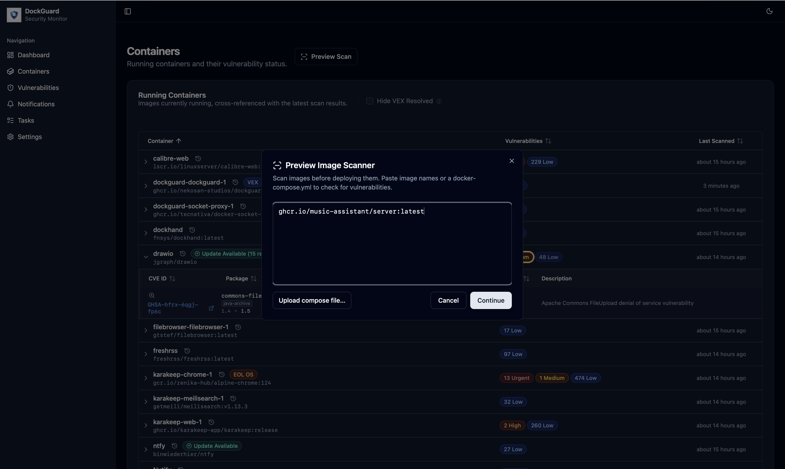
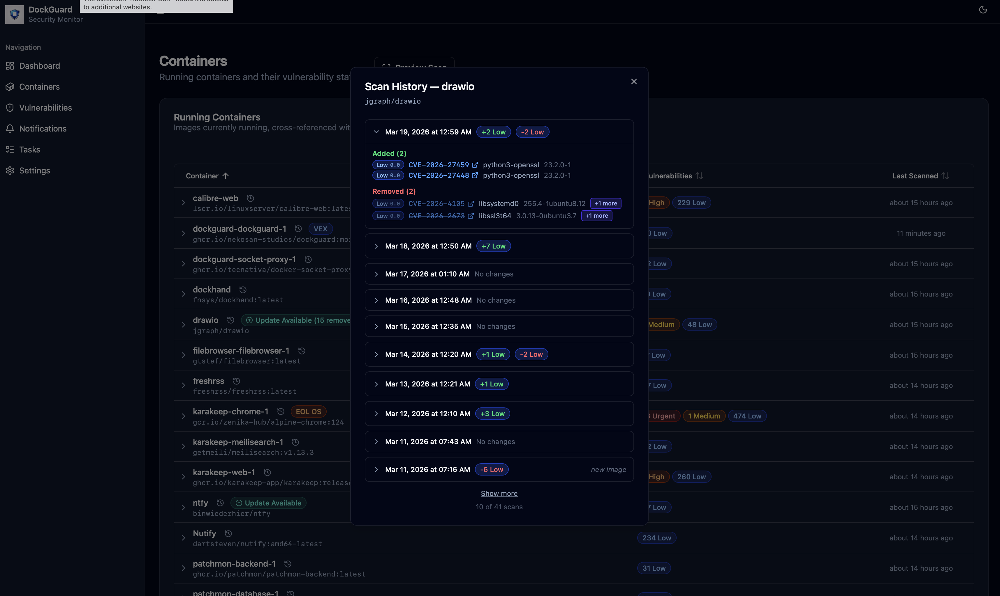

<div align="center">
  

  # DockGuard

  **Automatic vulnerability monitoring for your self-hosted Docker containers.**
</div>

---

DockGuard is a free, self-hosted security scanner. It watches your running Docker containers, automatically scans every image for known vulnerabilities, and gives you a clean web dashboard to understand your exposure.

> **Notes on Security:** 
- The recommended setup uses a proxy to ensure that DockGuard has minimal access to your Docker installation. 
- DockerGuard is currently limited to single-host setups. Features like multi-user support and connecting to multiple Docker installations are on the roadmap, but not yet available.  
- Because DockGuard does not currently have authentication or user login, do not expose it directly to the internet or untrusted networks. Run it behind a VPN, reverse proxy with authentication, or bind it only to `localhost` / your local network. If you need remote access, place it behind a solution like Authelia, Authentik, or your reverse proxy's built-in auth.

## Screenshots

**Dashboard**


**Containers**


**Vulnerabilities**


**Preview Scan**


**Scan History**


## Features

- **Simple to install** — Up and running after reviewing a few values in the docker compose file.

- **Always watching** — DockGuard monitors your running containers continuously. Pull a new image or update an existing one, and it's scanned automatically. No manual triggers, no cron jobs to configure.  Dockguard also automatically updates its vulnerability database whenever it is updated upstream.

- **Prioritise what actually matters** — Vulnerabilities are enriched with [CVSS](https://www.first.org/cvss/) severity scores, [EPSS](https://www.first.org/epss/) exploit probability, and the [CISA KEV](https://www.cisa.gov/known-exploited-vulnerabilities-catalog) (Known Exploited Vulnerabilities) catalog. Sort and filter by any of these to focus on the findings that matter in your context.

- **Detect EOL Base Images** - Alerts you when a container image is running an End-of-Life Base OS image that may no longer be receiving security patches.

- **New version detection** - Let's you know when a new version of any of your containers is available. Pre-scans the new version for vulnerability changes without affecting your Docker installation.

- **Review vulnerabilities before installing new apps** - Preview scan let's you provide a docker compose file or a list of images, and Dockguard will scan those images and report on vulnerabilities without installing the app into your local Docker environment.

- **Cut through false positives** — Some CVEs exist in an image but cannot actually be exploited in your environment. DockGuard supports [VEX (Vulnerability Exploitability eXchange)](https://www.cisa.gov/sites/default/files/2023-01/VEX_Use_Cases_Approved_508c.pdf) attestations: when an image publisher has officially marked a vulnerability as not exploitable in their image, DockGuard can suppresses it so you focus on real risk, not noise.

- **Track history** — See how your exposure changes as you update images and compare results across versions.

- **Notifications** — Get alerted when new vulnerabilities are found. DockGuard supports Apprise-compatible notification channels (Slack, Discord, email, and many more).

- **Fully self-hosted** — No cloud account. No telemetry. No subscription. DockGuard runs entirely on your machine and stores all data locally in a SQLite database.


## Requirements

- Docker w/Compose

That's it. Dockguard only supports local docker instances, so run it where your existing Docker stack lives. Everything else needed is bundled inside the DockGuard container.

## Quick Start

1. Download the compose file:

```bash
curl -O https://raw.githubusercontent.com/Nekosan-Studios/DockGuard/master/docker-compose.yml
```

2. Open `docker-compose.yml` and set at minimum:
   - `TZ` — your local timezone (e.g. `America/New_York`)

   The compose file uses [docker-socket-proxy](https://github.com/Tecnativa/docker-socket-proxy) by default, which limits DockGuard's Docker access to read-only container and image inspection. If you prefer a simpler single-container setup, follow the comments in the file to switch to a direct socket mount instead.

   The `docker-compose.yml` file contains the full list of available environment variables with descriptions and defaults.


3. Start it:

```bash
docker compose up -d
```

4. Open [http://localhost:8764](http://localhost:8764).

DockGuard will check to make sure the vulnerability database is up to date and begin scanning your containers within a few minutes.


## License

This project is licensed under the [Polyform Shield License 1.0.0](LICENSE.md).

Why this license?
We believe in the "Fair Source" philosophy. We want this tool to be accessible to everyone—from hobbyists in their homelabs to developers at large corporations—while ensuring the project's long-term sustainability.

For Developers & Companies: You can use, modify, and run this project for all internal business purposes for free.

For the Community: If you make public improvements or forks, the license ensures those stay available to everyone under these same terms.

For Competitors: You cannot take this project and sell it as a standalone "managed service" or competing commercial product.

## Was AI used to create Dockguard?
Yes. The primary developer of Dockguard has over 45 years of development experience, 30+ professionally. Code generated by AI is reviewed and understood. This is not a vibe-coded app created as a black box.
